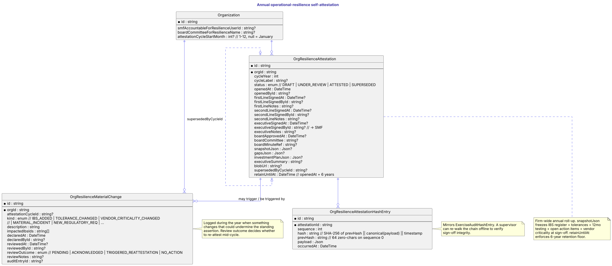

# Annual self-attestation

The firm-wide annual artefact that rolls up the IBS register, tolerances, 12 months of testing evidence, action items and gap analysis into a single signed document. Layered on top of the per-IBS `IBSAttestation` chain (see [IBS register](ibs.md)) — that captures granular sign-off for one service; this captures the firm-wide annual roll-up signed by the named SMF.

Shipped in R1: schema + snapshot service + audit codes. UI surfaces (cycle dashboard, sign-off flow, pack generator) land in R2–R5 — see the [domain-model writeup](../domain-model/resilience-attestation.md) for the full sequencing.

## Diagram



## How to read it

- **`OrgResilienceAttestation`** is one annual cycle. The three sign-off fields (`firstLine*` / `secondLine*` / `executive*`) capture the three-line evidence chain — first-line business owner, second-line risk/compliance, executive SMF. Board ratification is a free-text reference (committee + minute) because the platform doesn't model board membership.
- **`snapshotJson`** is the frozen rollup at sign-off — built by `buildResilienceSnapshot(orgId)` in `src/lib/resilience-attestation.ts`. Includes every approved IBS with its attestation chain + resource map, vendor criticality, exercise history for the last 12 months, open action items, material changes since the prior cycle.
- **`retainUntilAt`** is the hard six-year retention floor. Computed as `openedAt + 6 years` at row creation; cascade-delete paths must check it before permitting removal.
- **`supersededByCycleId`** points at a later cycle when a mid-year re-attestation lands (e.g. after a material change triggers reassessment). The superseded row stays retrievable for the full retention window.
- **`OrgResilienceMaterialChange`** logs in-year changes that might undermine the standing assertion. The `reviewOutcome` decides whether to `ACKNOWLEDGE`, `TRIGGER_REATTESTATION`, or close as `NO_ACTION`.
- **`OrgResilienceAttestationHashEntry`** mirrors `ExerciseAuditHashEntry` — every sign-off event appends a hash-chained record so a supervisor can re-walk the chain offline.

Three new fields on `Organization` configure the cycle: `smfAccountableForResilienceUserId` (named SMF), `boardCommitteeForResilienceName`, and `attestationCycleStartMonth` (month-of-year the cycle opens; null = January).

## Source

```plantuml

```

Canonical source: [`docs/data-schemas/src/attestation.puml`](src/attestation.puml). Edit there, re-render via `node scripts/render-erds.mjs attestation`, commit both files.
