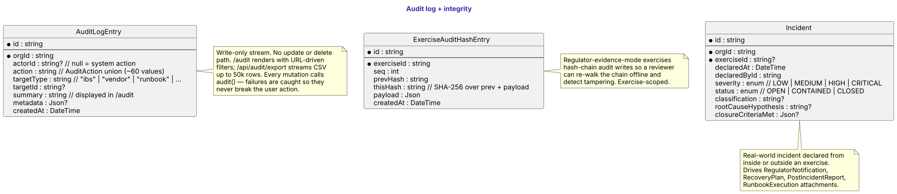
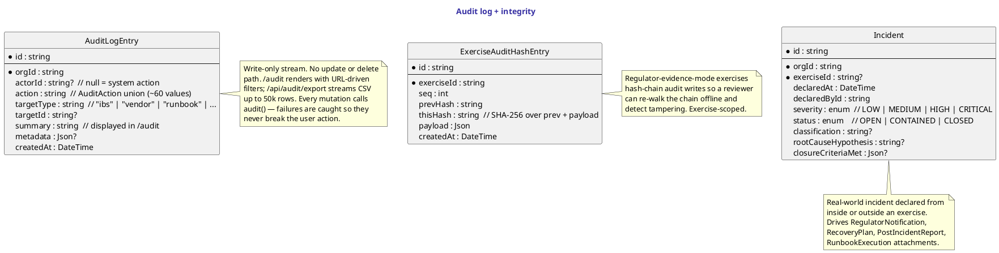

# Audit log + integrity

`AuditLogEntry` is the write-only stream every mutation in the platform pours into. ~60 `AuditAction` codes across nine domains (see [Audit log](../domain-model/audit-log.md) for the catalogue). The `/audit` page reads this table via the shared `buildAuditWhere` filter; `/api/audit/export` streams it as CSV up to 50k rows with the same filter as the page.

There's no update path and no delete path — once it lands, it stays. Storage cost is acceptable for v1; partitioning by month / year is on the roadmap if a customer's audit volume warrants it.

`ExerciseAuditHashEntry` is the tamper-evidence layer for regulator-mode exercises. Each entry stores the SHA-256 of the previous entry's payload, so a regulator verifying the evidence pack offline can re-walk the chain and detect any post-hoc edits. Exercise-scoped (one chain per regulator-mode exercise).

`Incident` is the real-world counterpart to an `Exercise` — a row gets declared when an exercise team chooses to convert their rehearsal into a real declaration, or when an out-of-band event hits the org. It drives the downstream artefacts: `RegulatorNotification` rows for the SLA clocks, `PostIncidentReport` for the 8-section formal report, `Retrospective` for the glad/sad/mad board, `RunbookExecution` for any runbooks attached to the response.

## Diagram

## Source

Canonical source: [`src/audit.puml`](src/audit.puml).
