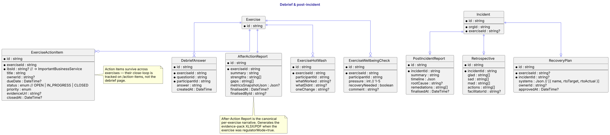
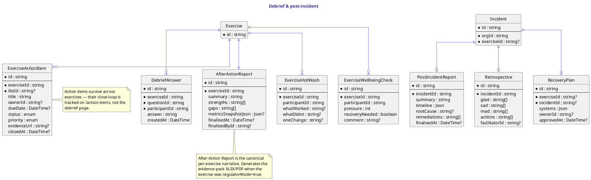

# Debrief & post-incident

After an exercise completes, the debrief layer captures what was learned. `DebriefAnswer` is the per-question response from each participant (against `DebriefQuestion` from the scenario). `AfterActionReport` is the facilitator's canonical narrative (summary + strengths + gaps + metrics snapshot), finalised by an approver and used to generate the evidence pack for regulator-mode runs.

`ExerciseActionItem` is the bridge from learning to follow-up — owner, due date, status (OPEN / IN_PROGRESS / CLOSED), priority, an evidence URL. Action items survive across exercises; the `/action-items` page is their close-loop home.

`ExerciseHotWash` is the immediate-after structured retrospective (what worked / what didn't / one change). `ExerciseWellbeingCheck` is the anonymous pulse check on participant pressure and recovery needs.

When an exercise becomes a real declared `Incident` (or one is declared independently), the post-incident layer kicks in: `PostIncidentReport` is the formal 8-section report, `Retrospective` is the glad/sad/mad/actions board, and `RecoveryPlan` carries the per-system RTO targets vs actuals.

## Diagram

## Source

Canonical source: [`src/debrief.puml`](src/debrief.puml).
