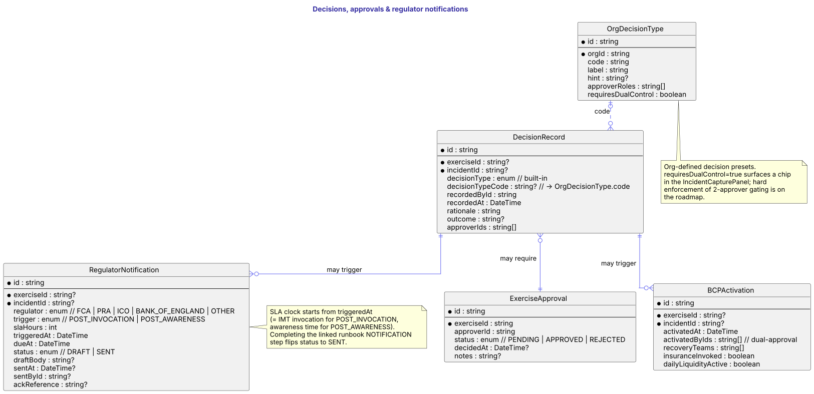
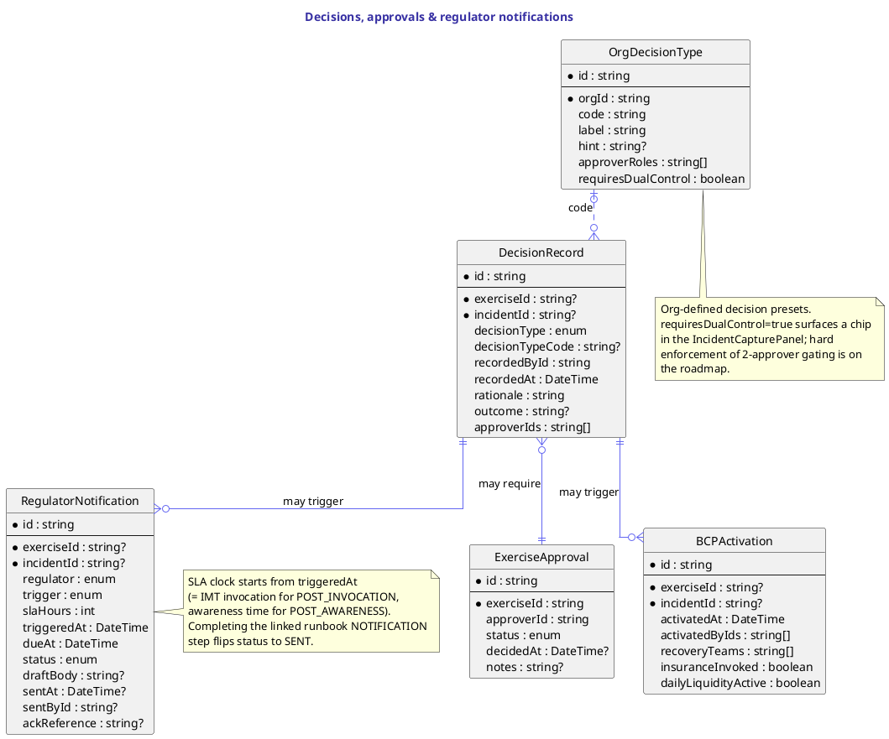

# Decisions, approvals & regulator notifications

`DecisionRecord` is the structured timestamp of every consequential call made during an exercise or incident — who recorded it, the rationale, the outcome, the approvers. Decisions reference either the built-in `DecisionType` enum (INVOKE_IMT, ACTIVATE_BCP, …) or an org-defined preset via `OrgDecisionType.code`.

`OrgDecisionType` is the per-org preset registry — `code`, `label`, `hint`, `approverRoles`, and the additive `requiresDualControl` flag that surfaces a "requires 2 approvers" chip in the IncidentCapturePanel + approvals dock. Hard enforcement of the two-approver gate is a planned follow-up.

`ExerciseApproval` is the per-exercise sign-off chain (PENDING → APPROVED / REJECTED). Regulator-mode exercises require at least one APPROVED row before they can be marked READY.

`BCPActivation` records a continuity activation — the dual-approval timestamps, mobilised recovery teams, the daily-liquidity gate, insurance-invocation decision. One row per activation, attached to either an exercise or an incident.

`RegulatorNotification` carries the SLA clock — `regulator` × `slaHours` × `triggeredAt` produces a `dueAt`. Completing the linked runbook NOTIFICATION step flips `status` to SENT and stamps `sentAt`.

## Diagram

## Source

Canonical source: [`src/decisions.puml`](src/decisions.puml).
