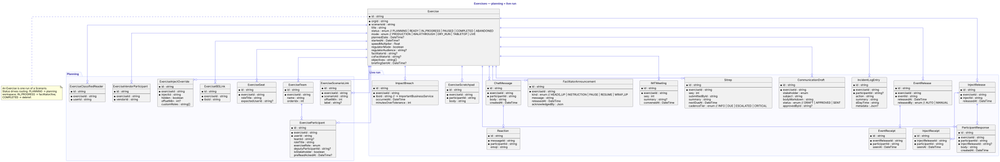

# Exercises — planning + live run

`Exercise` is one *run* of a `Scenario`. Its lifecycle is `PLANNING → READY → IN_PROGRESS → PAUSED → COMPLETED` (plus `ABANDONED`), and `status` drives routing: PLANNING lands on the planning workspace; IN_PROGRESS routes admins to `/facilitator` and participants to `/live`; COMPLETED redirects to `/debrief`.

The two halves of this diagram are visual only — there's one `Exercise` table; the *Planning* package collects rows created before kickoff, and the *Live run* package collects rows that only ever get written while the exercise is IN_PROGRESS (releases, receipts, log entries, comms, sitreps, IMT meetings, announcements, chat, scratchpads, breaches).

**Planning side:**
- `ExerciseScenarioLink` carries the chained-scenario list with `offsetMin` for compound runs
- `ExerciseTeam` + `ExerciseParticipant` model the org chart on the night, including a deputy chain (`deputyParticipantId`)
- `ExerciseSeat` is the *expected* roster — who's supposed to fill each role, used by the SMF quick-add
- `ExerciseInjectOverride` lets the wizard hide, retime, or re-address scenario injects without mutating the source
- `ExerciseClassifiedReader` enforces a strict reader-list for classified-mode exercises

**Live-run side:**
- `EventRelease` / `InjectRelease` fire when the D-Day clock crosses a scheduled time (or a facilitator triggers manually); `EventReceipt` / `InjectReceipt` track who has seen each release
- `IncidentLogEntry` is the freeform narrative timeline; `ParticipantResponse` is structured per-inject reply
- `Sitrep` has its own cadence engine — `cadenceTier` is one of INFO/DUE/ESCALATED/CRITICAL (see [Live workspace](../architecture/live-workspace.md))
- `FacilitatorAnnouncement` broadcasts to the room with a per-participant ack roster
- `ImpactBreach` rows are written when an IBS's elapsed-impact time exceeds its scenario tolerance

The full picture:

## Diagram

## Source

The full PlantUML source is long — see [`src/exercises.puml`](src/exercises.puml) for the verbatim source that generated the SVG above. Every child entity carries the same `*id` + `*exerciseId` shape (plus its own attributes); the source spells out each field but the SVG is the authoritative visual.
