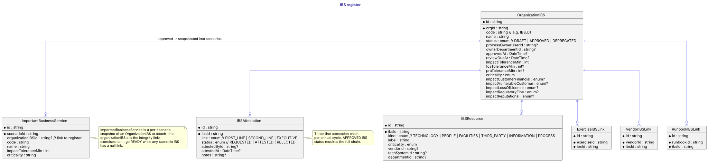
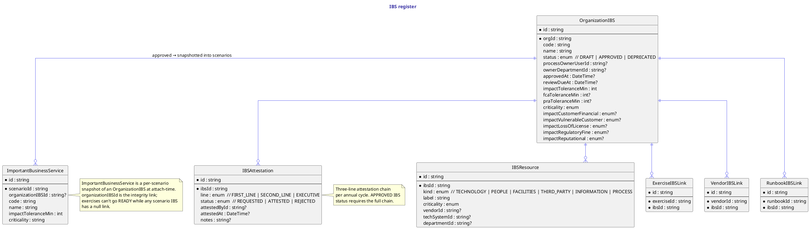

# IBS register

The IBS register is the firm's canonical list of Important Business Services. `OrganizationIBS` carries the governance (process owner, second-line reviewer, approval timestamp, review-due date), the methodology fields (impact tolerance + per-regulator tolerances, six-dimension importance assessment), and the structured `IBSResource` map.

`IBSAttestation` is the three-line-of-defence chain: FIRST_LINE (process owner) → SECOND_LINE (oversight) → EXECUTIVE (accountable SMF). A register entry only earns `status = APPROVED` once the chain completes.

Three link tables wire the register into the rest of the platform: `ExerciseIBSLink` (which IBSs an exercise tests), `VendorIBSLink` (which IBSs a vendor supports), `RunbookIBSLink` (which IBSs a runbook covers).

`ImportantBusinessService` is a per-scenario snapshot, not a register entry — see [Scenarios & MSEL](scenarios.md). Its `organizationIBSId` is the integrity link back; the [scenario IBS register integrity](../user-guide/exercises-design.md) rule blocks exercises from going Ready while any scenario IBS has a null link.

## Diagram

## Source

Canonical source: [`src/ibs.puml`](src/ibs.puml).
