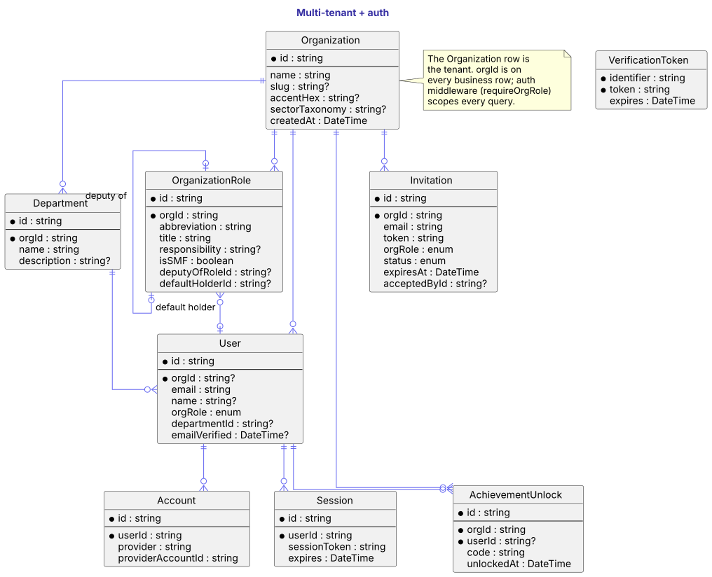
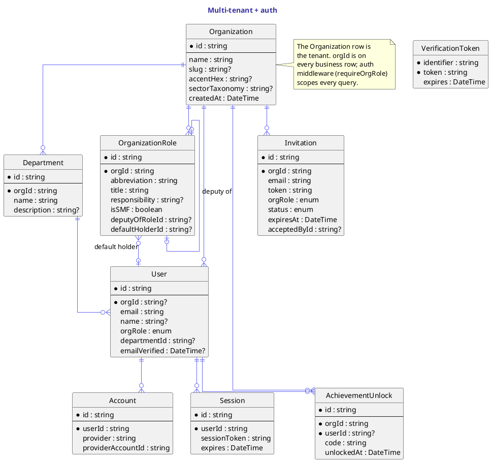

# Multi-tenant + auth

`Organization` is the tenant. Every business row carries an `orgId` and is scoped to its org by `requireOrgRole` (see [Auth & permissions](../architecture/auth-and-permissions.md)). Auth itself sits on NextAuth v4 with the `Account` / `Session` / `VerificationToken` triad.

`Department` and `OrganizationRole` model the org chart: departments own IBSs end-to-end; roles carry an SMF flag and a deputy-of self-relation so the firm's accountability mapping is first-class. `OrganizationRole.defaultHolderId` lets the exercise wizard's SMF quick-add slot the obvious person into a seat with one click.

`Invitation` is an email + token + role; `AchievementUnlock` is the lightweight engagement layer (admin first-runs, first-exercise-completed, etc.).

## Diagram

## Source

Canonical source: [`src/multi-tenant.puml`](src/multi-tenant.puml).
