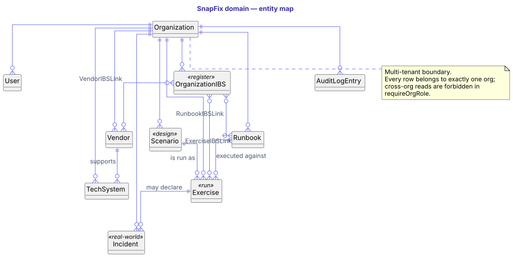
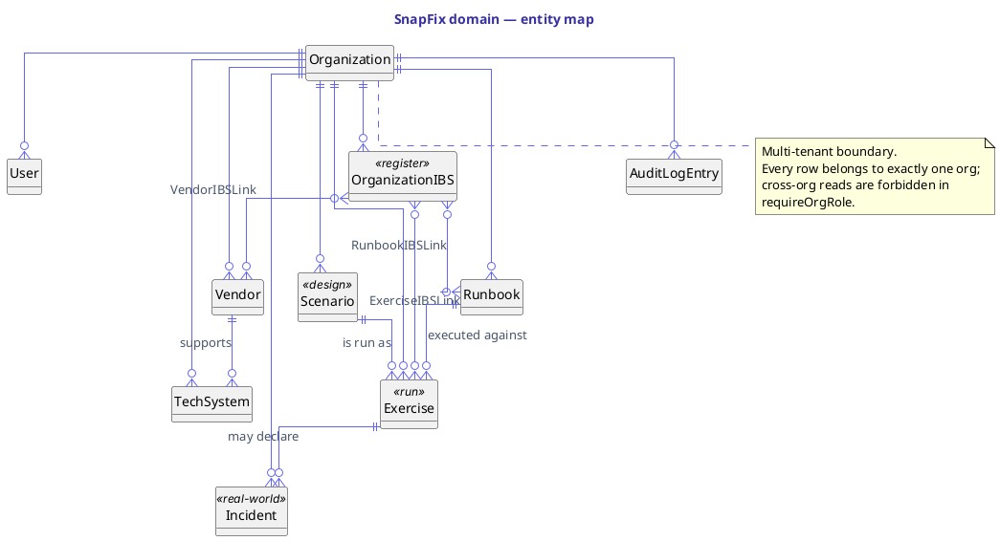

# Data schemas — overview

The SnapFix data model is one Postgres schema (Neon-hosted) accessed via Prisma 7. **75 models, 57 enums** in [`prisma/schema.prisma`](https://github.com/moni-veltor/snapfix/blob/main/prisma/schema.prisma) — too many for a single ERD. This section partitions them into ten domain diagrams.

## How to read these pages

Each page has three things:

1. **A short narrative** — what the cluster does, who reads and writes it, lifecycle notes.
2. **An ERD** (PlantUML, rendered to SVG by `scripts/render-erds.mjs` via Kroki).
3. **The PlantUML source** in a `puml` code block — canonical, hand-editable, the thing you change when the schema changes.

Cardinality reading: `||--o{` means "one to many (zero-or-more)", `}o--o{` means "many to many", `||--o|` means "one to zero-or-one". Crow's-foot on the many side.

Field lists are **selective** — primary key, foreign keys, and the handful of attributes you need at a glance. The full surface is in `prisma/schema.prisma`.

## Updating the diagrams

```bash
# 1. Edit the .puml source
$EDITOR docs/data-schemas/src/<name>.puml

# 2. Re-render (Kroki POST, no install required)
node scripts/render-erds.mjs <name>    # one
node scripts/render-erds.mjs           # all

# 3. Commit both the .puml source and the .svg output
git add docs/data-schemas/src/<name>.puml docs/data-schemas/img/<name>.svg
```

The render script is a single `fetch` to `https://kroki.io/plantuml/svg`. No local PlantUML or Java required.

## The entity map

The diagram below shows the top-level entities and the relations between them — no fields. Use it to orient before drilling into a specific domain page.



**Reading it.** `Organization` is the multi-tenant boundary; every other row's `orgId` traces back to it (enforced in `requireOrgRole`). `Scenario` is *design-time*, `Exercise` is the *run*. `Incident` is the real-world counterpart to an exercise — declared when a rehearsal becomes a live event or when an out-of-band incident hits the org. `IBS`, `Vendor`, `TechSystem`, and `Runbook` are the registers that everything else references.

## Sections

| Page | What's in it |
|---|---|
| [Multi-tenant + auth](multi-tenant.md) | Organization, Department, OrganizationRole, User, Account, Session, VerificationToken, Invitation, AchievementUnlock |
| [IBS register](ibs.md) | OrganizationIBS, IBSAttestation, IBSResource, ExerciseIBSLink, VendorIBSLink, RunbookIBSLink, the snapshotted ImportantBusinessService |
| [Scenarios & MSEL](scenarios.md) | Scenario, ImportantBusinessService, Event, EventIBS, Inject, Artefact, FacilitatorQuestion, DebriefQuestion |
| [Exercises — planning + live run](exercises.md) | Exercise plus all child models for planning (teams, participants, seats, overrides) and live capture (releases, receipts, log, comms, sitreps, IMT meetings, announcements, chat, scratchpad, breaches) |
| [Decisions, approvals & regulator notifications](decisions.md) | OrgDecisionType, DecisionRecord, ExerciseApproval, BCPActivation, RegulatorNotification |
| [Debrief & post-incident](debrief.md) | DebriefAnswer, AfterActionReport, ExerciseActionItem, ExerciseHotWash, ExerciseWellbeingCheck, PostIncidentReport, Retrospective, RecoveryPlan |
| [Vendors & tech systems](vendors-tech.md) | Vendor, VendorAssessment, VendorMtpNotification, VendorRegisterSnapshot, VendorIBSLink, TechSystem, DRTest |
| [Runbooks](runbooks.md) | Runbook, RunbookStep, RunbookIBSLink, RunbookScenarioLink, RunbookTriggerCondition, RunbookEscalation, RunbookExecution, RunbookStepExecution |
| [Audit log + integrity](audit.md) | AuditLogEntry, ExerciseAuditHashEntry, Incident |

## Source



Canonical source: [`docs/data-schemas/src/overview.puml`](src/overview.puml). Edit there, re-render via `node scripts/render-erds.mjs overview`, commit both files.
