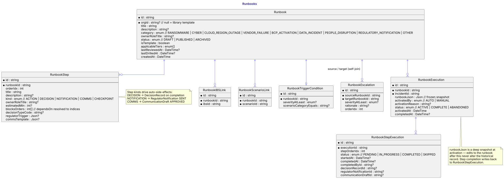
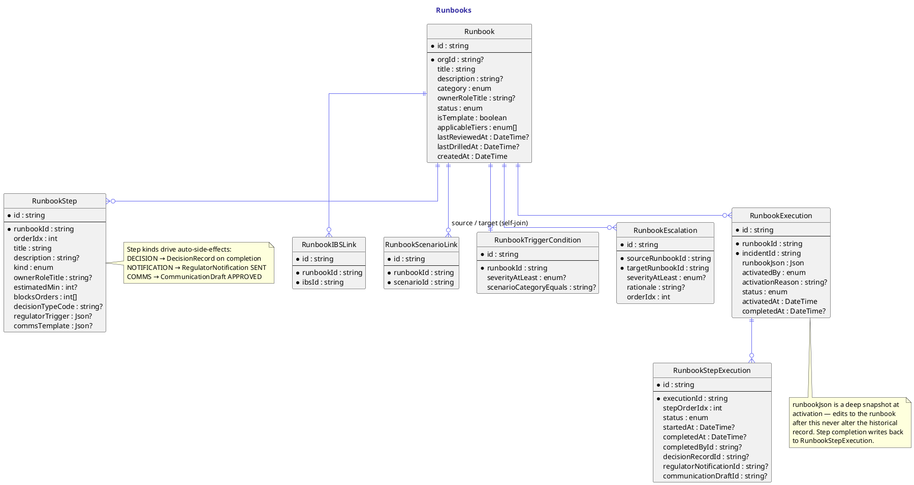

# Runbooks

`Runbook` is a per-org playbook (or a library template when `isTemplate = true`). It carries the category, the owner role, the tier filter (`applicableTiers`), the review + drill timestamps, and the status (DRAFT / PUBLISHED / ARCHIVED).

`RunbookStep` is one ordered step. The `kind` is the most important field — each kind drives a different side-effect when the step completes:

- `ACTION` — owner-role marks complete; no side-effect.
- `DECISION` — completion auto-writes a `DecisionRecord` (and an `IncidentLogEntry`) using `decisionTypeCode`.
- `NOTIFICATION` — starting the step creates a `RegulatorNotification` with the SLA clock from `regulatorTrigger`; completing flips it to SENT.
- `COMMS` — starting creates a `CommunicationDraft` from `commsTemplate`; completing marks it APPROVED.
- `CHECKPOINT` — coordination point ("everyone signed off").

`dependsOn` is a string array of earlier step slugs; the clone action resolves these to `blocksOrders` (integer indices) so the DAG is stored in a single canonical form.

`RunbookIBSLink`, `RunbookScenarioLink`, and `RunbookTriggerCondition` wire the runbook to the rest of the platform. `RunbookEscalation` is the self-join that chains runbooks — when a ransomware runbook fires, it can auto-escalate to BCP activation, FCA notification, ICO 72h, etc. The clone resolver inserts these in both directions (forward + reverse) so chains work however the user activates the first runbook.

`RunbookExecution` is the live snapshot — `runbookJson` freezes the runbook + every step at activation time. Edits-after-activation never alter the historical record; step completion writes back to `RunbookStepExecution` (one per step, per execution).

## Diagram

## Source

Canonical source: [`src/runbooks.puml`](src/runbooks.puml).
