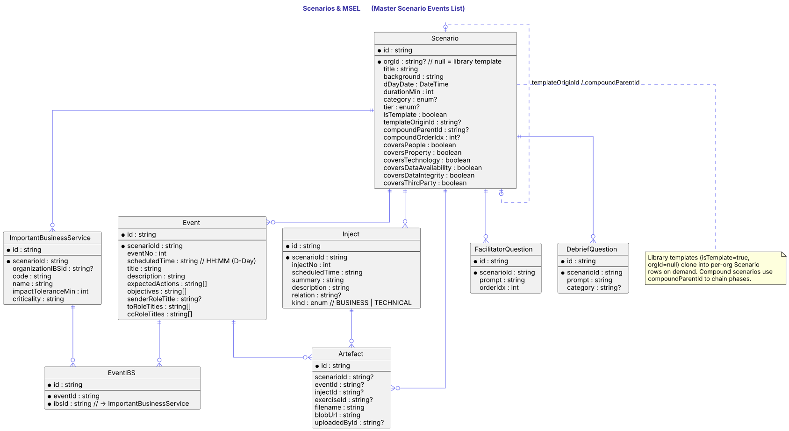
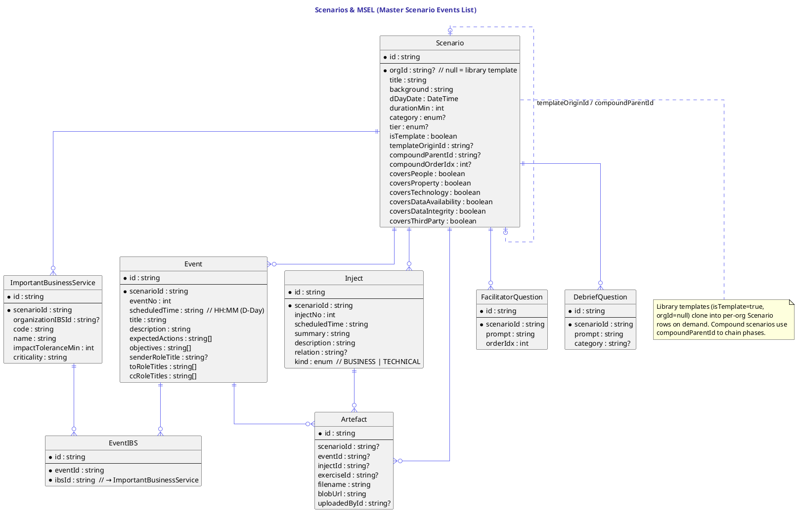

# Scenarios & MSEL

A `Scenario` is the *design* — framing, CMORG metadata, coverage flags, and the children that form the Master Scenario Events List (MSEL). Library templates live as `Scenario` rows with `isTemplate = true` and `orgId = null`; cloning them into an org snapshots a fresh `Scenario` row plus all its children.

`Event` is a scheduled stimulus at a D-Day `HH:MM` time, addressed from/to/cc role titles. `Inject` is a supplementary stimulus (BUSINESS or TECHNICAL) inside an event window. `EventIBS` ties an event to the IBSs it stresses, so tolerance-breach computation can attribute pressure correctly during the live run.

`ImportantBusinessService` is the per-scenario IBS row. It carries an optional `organizationIBSId` FK back to the org's register — the [scenario IBS register integrity](../user-guide/exercises-design.md) constraint requires every row to be linked to an APPROVED entry before exercises can transition to READY.

`Artefact` is the file-attachment polymorphism — a row can attach to a scenario, an event, an inject, or an exercise. Storage is Vercel Blob; metadata is in Postgres.

`FacilitatorQuestion` and `DebriefQuestion` are the question banks asked during and after the run respectively.

## Diagram

## Source

Canonical source: [`src/scenarios.puml`](src/scenarios.puml).
