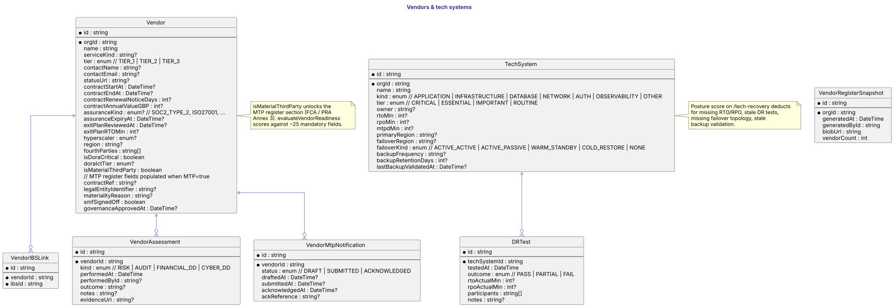
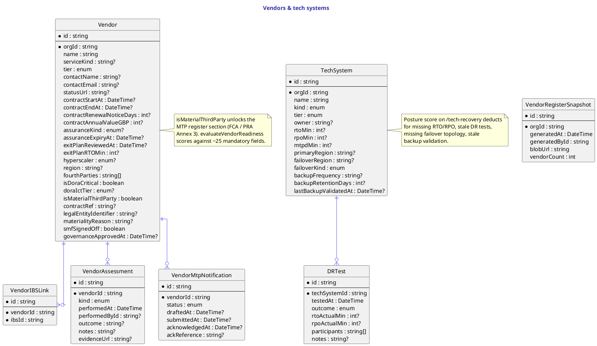

# Vendors & tech systems

`Vendor` is the org's third-party register. The basics (name, tier, contacts, status URL) cover every entry; the contract / assurance / exit-plan blocks cover governance; the DORA fields (`isDoraCritical`, `doraIctTier`, `hyperscaler`, `region`, `fourthParties`) cover EU operational-resilience reporting; the MTP register fields (unlocked when `isMaterialThirdParty = true`) cover the ~25 FCA / PRA Annex 3 mandatory fields.

`VendorIBSLink` is the many-to-many to the IBS register. `VendorAssessment` is append-only — one row per RISK / AUDIT / FINANCIAL_DD / CYBER_DD assessment. `VendorMtpNotification` carries the DRAFT → SUBMITTED → ACKNOWLEDGED notification filing flow. `VendorRegisterSnapshot` is the immutable annual XLSX snapshot (Vercel Blob URL + row count) that gets handed to the regulator.

`TechSystem` is the inverse of the IBS register: customer-facing services vs the underlying systems that support them. It carries the recovery objectives (RTO / RPO / MTPD), the failover topology, and the backup posture. `DRTest` is the disaster-recovery test ledger — each row stamps an outcome (PASS / PARTIAL / FAIL) against a system, with the actual RTO/RPO measured during the test.

The posture score on `/tech-recovery` deducts for missing tolerances, stale DR tests (> 1 year), failed tests, missing failover topology on critical systems, and backup not validated > 90 days.

## Diagram

## Source

Canonical source: [`src/vendors-tech.puml`](src/vendors-tech.puml).
